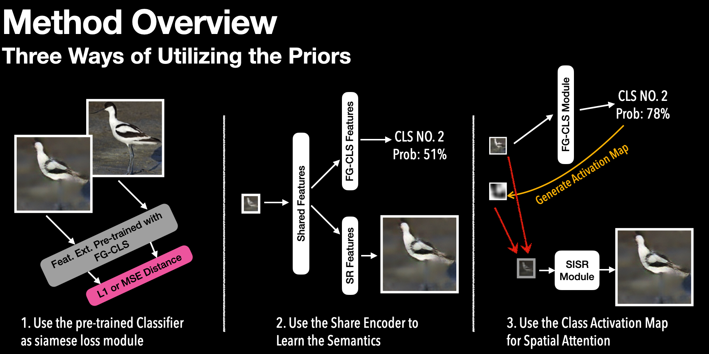
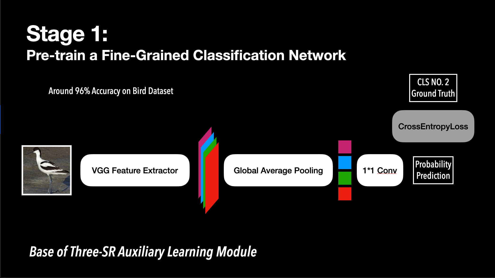
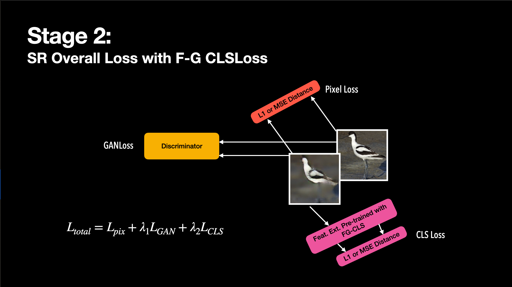
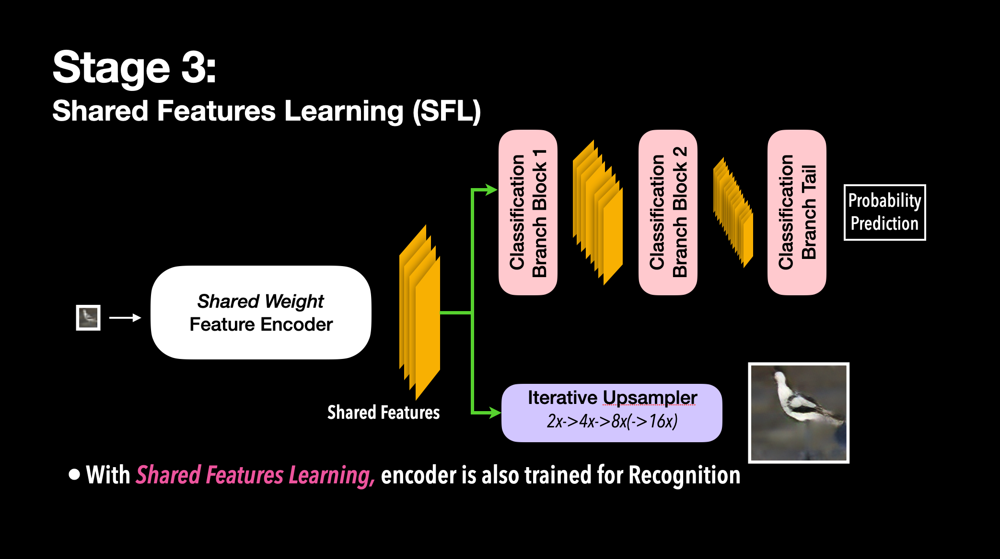
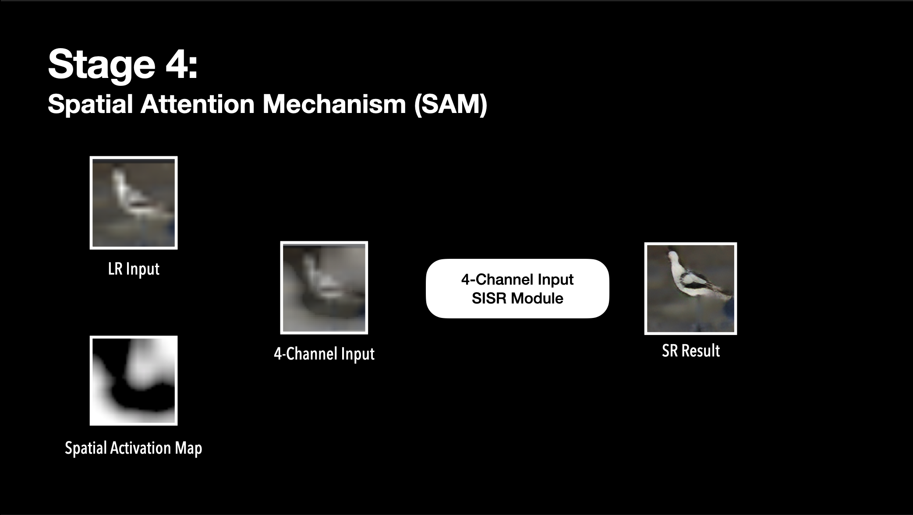
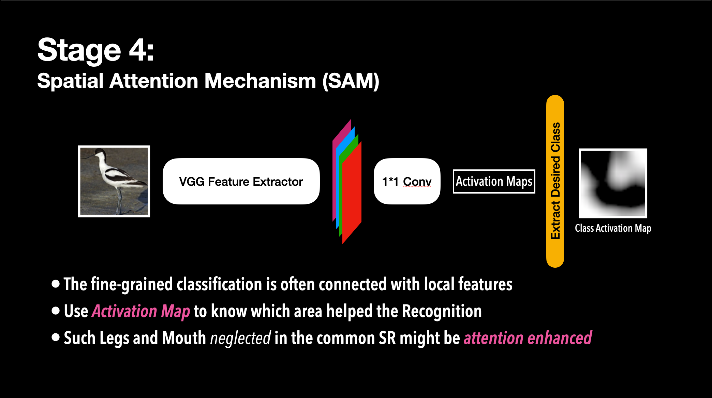
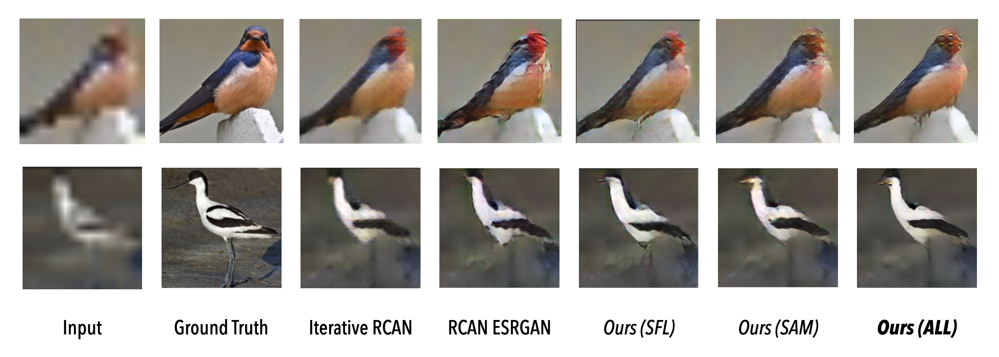

# Shared Features Learning on Semantic-Favorable Super Resolution
CVDL2020 Project, Contributed by Haoning Wu, Jiaheng Han

Mentor: Yadong Mu

## Background and Motivation

Super Resolution task this year has been progressed by Deep End-to-end Neural Networks. When talking about Single Image Super Resolution (SISR), we are always wondering where the implicit mechanism of the encoder-decoder structure of such end-to-end networks lies. 

Most common view is that the SR generator (encoder-decoder) becomes some feature extractor which learns "add what details on what original textures", and among these years, GAN-based methods are proposed to learn the **latent distribution** of real images and generate more photo-realistic SR result instead of just trying to improve the PSNR/SSIM performance.

So, our baseline methods are set as RCAN in 2018 and ESRGAN pipeline (with RCAN generator) in 2018.

However, GAN surely can make "realistic" textures on SR domain, but it fails to decode the distinct semantics into different textures, which often generates statistically real but not semantically reasonable textures. This thing fails especially when we try to reconstruct large scale (e.g. *14 by 14 -> 224 by 224, 16x*)  ground truth of faces or other fine-grained specific contents: we may SR a smiling face into something very strange, maybe an angry face, or something not a face.

Another problem often confusing researchers is the Low Resolution fine-grained classification, focusing on more real-world fine-grained classification usage where the recognition objective is a small part of the whole input and is detected through some coarse-grained detection algorithm. When often **the higher-scale fine-grained classification** networks are learnt, these networks do not transfer well on small samples. 

On the contrary, recent researches on fine-grained classification has demonstrated that the attention areas (where the pixels contribute the most to the Prediction Labels) are often very local, which suggests that prior knowledge from common fine-grained classification will be focusing more on **local semantic features**.

Now the branches are set together and consider how a human see something far: we're doing the "what this is (recognition)" and "human eye super-resolution" synchronously, where the two task help each other in this mechanism.

**We desire to construct deep learning pipelines to modulate human eye super-resolution process, learn Semantic-Favorable Super Resolution, especially in extreme cases.** For this purpose, we have decided to indirectly use our pretrained higher-scale fine-grained classfication models, and use this thing to both help the Semantic-Favorable Super Resolution and Low-Scale Fine-Grained Classification. Our contributions are mainly as follows:

- First, without introducing real labels of the Low Resolution fine-grained images, we designed a specific feature-extractor prior module into the common SR pipeline as a prior and help the Super Resolution network to learn more "realistic" results not only in textures, but in semantics as well.
- Second, we carefully designed the **shared features** learning for *Super Resolution* and *Low Resolution Classfication*, enforcing the encoder to learn both semantic and textural features and helps extract the latent distribution of the image space. This will both help low-res recognition and extreme super resolution, where in this paper we only talk about the latter one.
- Third, we composed the spatial attention mechanism which can make use of class activation maps to localize the attention areas and help rebuild semantic-favorable super resolution results on heat point areas.

## Method Overview

Our method is based on "Learning from the Recognition priors". Because of the characteristics of the priors, we proposed **three ways of Utilizing the Priors**, shown in the following figure.



And the prior is based on the pre-training of the following FCN-VGG Classifier.


You can see the detailed method in how-to-train section.


## How to Train

You may download the [pretrained models](https://pan.baidu.com/s/1J3Gmh73fby4g7w5d9c8aJg)(Code:uleh). 

There are generally four stages of the whole experiment pipeline.

### Stage 1: Pre-train a fine-grained classification



RUN as follows. It will take around 20 minutes for pre-processing.

```shell
python3 pre_train.py
```

Please rename your pre-trained model as *../bird/prt.pth* before processing the following stages.

**If you have only got HR datasets, please run ``python3 downsampler.py`` to generate LR samples.**

### Stage 2: Add Fine-Grained Classifier Loss



The overall loss with CLSLoss added is shown in the figure above.

You may try both ways of importing this loss, 
1. directly learning from pre-trained classification results, 
2. learn from the feature layers in the pre-trained *Classification Module*. The second one is set as default.

RUN as follows.

```shell
python3 train.py -opt Stage_2.yml
```

### Stage 3: Shared-Features Learning (SFL)



RUN as follows.

```shell
python3 train.py -opt Stage_3.yml
```

*REMINDer: The low-res Classification result is not benchmarked in the process above.*

### Stage 4: Spatial Attention Mechanism (SAM)



Before training Stage 4, you should at first generate the class activation map dataset and place it in the directory corresponding to [it](Stage_4.yml). The figure above shows the method used in [cam_generator.py](cam_generator.py)

```shell
python3 cam_generator.py
```



Then RUN as follows.

```shell
python3 train.py -opt Stage_4.yml
```

### Combine the Stages
```shell
python3 train.py -opt train.yml
```

## How to Test

*Test our proposed method----*

```shell
python3 test.py -opt test.yml
```

*or to test the baseline----*

```shell
python3 test.py -opt test_baseline.yml
```

But prepare the [test dataset (HR)](https://pan.baidu.com/s/1zWnC4cM0HMQEivQu6b4M3A)(Code:ynoy), [test dataset (LR and CAM)](https://pan.baidu.com/s/1RD1IgzXyJi5EaUSXmYDtZQ)(Code:79f2) and the [pretrained models](https://pan.baidu.com/s/1J3Gmh73fby4g7w5d9c8aJg)(Code:uleh) in your directory and keep it the same with the options in [Proposed](test.yml) and [Baseline](test_baseline.yml).

**We use Baidu Drive to store the pretrained models and test dataset, please click the hyperlink.**


## Experimental Results

### Qualitative Results (Bird)



Remark the **head and legs** of the two birds, SFL has obviously better reconstruction on these parts.

The SAM is relatively weaker on reconstructing these parts, however it produces more realistic bird body, comparing to the baseline ESRGAN algorithm.

### Quantitive Comparison

We have tested the following combinations so far, showing the previledge of our method on preserving the structural similarity and obtain better image quality on IQA (Image Quality Assessment) modules. With ablation study, the Share Features Module should become the one that contributes most in the three, while the only CLSLoss even degrades the performance. 

The result of only CLSLoss (Stage 2) does not match our expectation, so we removed that module in the combination evaluation and will continue on optimizing this part.

| **Stage/Scale**                       | **PSNR**⬆️ | **SSIM**⬆️ |**LPIPS**⬇️ |
| ------------------------------------- | --------- | --------- | --------- |
| Baseline Iterative RCAN               | **18.99** | **0.502** |   0.568   |
| Baseline ESRGAN                       |   17.77   |   0.446   |   0.412   |
| Only CLSLoss                          |   16.88   |   0.403   |   0.478   |
| Only Share Features                   |   18.33   |   0.479   |   3.908   |
| Only Spatial Attention                | **18.58** | **0.484** |   0.411   |
| *Shared Features + Spatial Attention* |   17.93   |   0.465   | **0.373** |

However, traditional benchmarks are not capable of representing the semantics (*the baseline is also not bad on LPIPS but losing much semantics*), so we may introduce some semantic-aware deep IQA methods into evaluation in the future. That would be another work.

